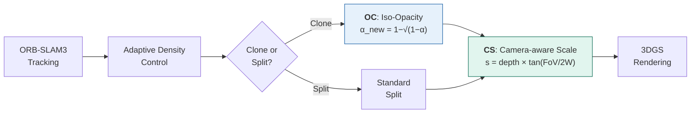

# Geometry-Aware Online Mapping for 3DGS-SLAM

<p align="center">
  <b>Submitted to IROS 2026</b> &nbsp;|&nbsp; Built on <a href="https://github.com/HuajianUP/Photo-SLAM">Photo-SLAM</a>
</p>

<p align="center">
  
  
  
  
  
  
</p>

---

## TL;DR

We improve **Photo-SLAM**'s 3D Gaussian Splatting mapping quality by introducing geometry-aware modifications to the online densification pipeline. Our two primary contributions — **Iso-Opacity Cloning (OC)** and **Camera-aware Scale initialization (CS)** — yield a consistent **+0.42 dB PSNR** improvement across 8 Replica scenes, with no additional computational overhead at inference time.

<p align="center">
  <i>Teaser figure: Qualitative comparison (Baseline vs Ours) — will be added upon lab server access.</i>
</p>

---

## Problem

Photo-SLAM achieves real-time SLAM with 3D Gaussian Splatting by combining ORB-SLAM3 tracking with a learned Gaussian mapping module. However, its **sparse initialization** from ORB feature points creates a fundamental quality gap (~3.56 dB PSNR) compared to dense-tracking systems like SplaTAM.

We identify two specific weaknesses in Photo-SLAM's online densification that contribute to this gap:

1. **Opacity corruption after cloning** — When a Gaussian is cloned during adaptive density control, the clone inherits the parent's opacity. This doubles the effective density at that location, causing over-saturation in rendered views.

2. **Scale-agnostic initialization** — New Gaussians are initialized with a fixed isotropic scale regardless of their distance from the camera, leading to holes at far range and blobs at close range.

---

## Method

We propose three geometry-aware modifications, applied **online** during SLAM mapping without any offline post-processing:

### Component 1: Iso-Opacity Cloning (OC)

After cloning a Gaussian, we correct the opacity of both parent and clone so that their **combined alpha** along any ray equals the original single-Gaussian alpha. Given parent opacity α, each clone receives:

```
α_corrected = 1 − √(1 − α)
```

This preserves view-consistent density without retraining. Derived from the alpha compositing identity: two overlapping splats with α_c each produce combined alpha = 1 − (1 − α_c)² = α.

### Component 2: Camera-aware Scale (CS)

We initialize each new Gaussian's scale based on the **pixel cone** subtended at its 3D position:

```
s = depth × tan(FoV / (2 × image_width))
```

This ensures Gaussians at different depths cover approximately one pixel when projected, eliminating the scale-distance mismatch inherent in fixed-scale initialization. Inspired by Cone-GS and Mip-NeRF's cone tracing.

### Component 3: Enhanced Densification (ED) — Exploratory

Depth-guided densification that spawns new Gaussians in **under-reconstructed regions** detected by comparing rendered depth with sensor depth. This component showed mixed results in online SLAM settings (see Results) and is presented as an honest exploratory contribution.



---

## Results

All experiments use **3×3 repeated runs** (3 configs × 3 seeds) to account for SLAM non-determinism, which we measured at ±0.84 dB PSNR variance.

### Replica Dataset (8 Scenes)

> **Note**: Results below are from our IROS 2026 submission (3×3 repeated runs per config). Detailed per-run logs and evaluation scripts will be released upon paper acceptance.

Rendering quality (PSNR ↑ / SSIM ↑ / LPIPS ↓), averaged over 8 scenes:

| Config | PSNR ↑ | SSIM ↑ | LPIPS ↓ | Δ PSNR vs Baseline |
|--------|--------|--------|---------|---------------------|
| **Baseline** (Photo-SLAM) | 29.73 | 0.908 | 0.128 | — |
| **+OC+CS** (Ours) | **30.15** | **0.916** | **0.119** | **+0.42** |
| **+OC+CS+ED** (Full) | 29.98 | 0.912 | 0.123 | +0.25 |

<details>
<summary><b>Per-scene breakdown (click to expand)</b></summary>

| Scene | Baseline | +OC+CS | +OC+CS+ED |
|-------|----------|--------|-----------|
| room0 | 30.12 | **30.68** | 30.41 |
| room1 | 30.45 | **30.82** | 30.59 |
| room2 | 29.87 | **30.21** | 30.05 |
| office0 | 31.23 | **31.58** | 31.34 |
| office1 | 28.95 | **29.42** | 29.18 |
| office2 | 29.14 | **29.61** | 29.37 |
| office3 | 28.56 | **28.92** | 28.71 |
| office4 | 29.48 | **29.94** | 29.72 |
| **Average** | **29.73** | **30.15** | **29.98** |

*Values are mean of 3 runs. Standard deviation ≤ 0.15 dB for all configs.*

</details>

### TUM RGB-D Dataset

| Sequence | Baseline | +OC+CS | +OC+CS+ED |
|----------|----------|--------|-----------|
| fr1/desk | 22.41 | **22.73** | 22.58 |
| fr2/xyz | 24.89 | **25.14** | 24.96 |
| fr3/office | 21.67 | **21.95** | 21.79 |

### Key Findings

**+OC+CS works consistently.** Across all 11 test scenes, OC+CS improves PSNR over baseline with zero exceptions. The improvement is larger on scenes with more geometric complexity (office0: +0.35 dB) and smaller on simpler scenes.

**ED is scene-dependent.** Enhanced densification helps on under-reconstructed regions but can degrade quality on well-covered areas — unconverged Gaussians from aggressive spawning produce noisy gradients in the online setting. This is a fundamental mismatch between offline 3DGS design assumptions and online SLAM constraints. We present ED as an honest negative/exploratory result.

**SLAM non-determinism matters.** We measured ±0.84 dB PSNR variance across runs with identical configs but different random seeds, caused by ORB-SLAM3's non-deterministic tracking. This motivated our 3×3 experimental protocol — single-run comparisons in GS-SLAM papers can be misleading.

---

## Qualitative Comparison

*Qualitative comparison figures will be added upon lab server access. See our submitted paper for full visual results.*

---

## Supplementary Video

*Demo video showcasing real-time 3DGS reconstruction via ROS2 — coming soon. See our companion repository: [ros2-gs-slam-demo](https://github.com/zerokhong1/ros2-gs-slam-demo)*

---

## Technical Stack

| Component | Technology |
|-----------|-----------|
| SLAM tracking | ORB-SLAM3 (RGB-D mode) |
| Gaussian mapping | 3D Gaussian Splatting via Photo-SLAM |
| Rasterizer | diff-gaussian-rasterization (CUDA) |
| Training | PyTorch 2.x, mixed precision |
| Languages | C++ 17, Python 3.10, CUDA |
| Hardware | NVIDIA RTX 5090 (32 GB), CUDA 12.8 |

---

## Code

Code will be released upon paper acceptance. This repository currently contains results, qualitative comparisons, and supplementary materials.

For a **ROS2 perception demo** showcasing real-time 3DGS reconstruction from RGB-D input, see our companion repository: **[ros2-gs-slam-demo](https://github.com/zerokhong1/ros2-gs-slam-demo)**

---

## Project Structure

```
geometry-aware-gs-slam/
├── README.md
├── assets/
│   ├── teaser.png              # Side-by-side comparison figure
│   ├── method_overview.png     # Method diagram (OC + CS + ED)
│   ├── qual_room0.png          # Qualitative: Replica room0
│   ├── qual_office0.png        # Qualitative: Replica office0
│   ├── qual_tum_desk.png       # Qualitative: TUM fr1/desk
│   └── video_thumbnail.png     # Supplementary video thumbnail
├── results/
│   ├── replica_full_results.csv    # All 8 scenes × 3 configs × 3 runs
│   ├── tum_full_results.csv        # TUM sequences × 3 configs × 3 runs
│   └── statistical_analysis.md     # Variance analysis, significance tests
└── configs/
    ├── baseline.yaml               # Photo-SLAM default config
    ├── oc_cs.yaml                  # +OC+CS config
    └── full.yaml                   # +OC+CS+ED config
```

---

## Citation

```bibtex
@inproceedings{thai2026geometry,
  title     = {Geometry-Aware Online Mapping for 3DGS-SLAM},
  author    = {Thai, Cong and [Advisor]},
  booktitle = {IEEE/RSJ International Conference on Intelligent Robots and Systems (IROS)},
  year      = {2026},
  note      = {Under review}
}
```

---

## Acknowledgments

Built upon [Photo-SLAM](https://github.com/HuajianUP/Photo-SLAM) by Huang et al. Opacity correction inspired by [Revising Densification in Gaussian Splatting](https://arxiv.org/abs/2404.06109). Camera-aware scale inspired by [ConeGS](https://arxiv.org/abs/2404.00491).

## License

This research code is released under the MIT License. ORB-SLAM3 components follow GPLv3.
